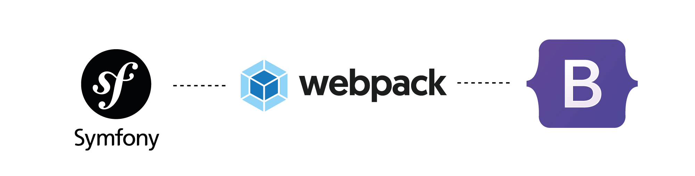

# Intégration de Webpack sur  Symfony avec l'ajout de la nouvelle version 5 de bootstrap


<br>

## WEPPACK : 
> ### webpack est un regroupeur de modules statiques pour les applications JavaScript modernes. Lorsque webpack traite votre application, il construit en interne un graphe de dépendances qui cartographie chaque module dont votre projet a besoin et génère un ou plusieurs paquets.


<br>

## 1 - Installer **Encore** : 

<br>

> Webpack Encore est un moyen plus simple d'intégrer Webpack dans votre application. Il enveloppe Webpack, vous offrant une API propre et puissante pour regrouper les modules JavaScript, prétraiter les CSS et JS et compiler et réduire les ressources. Encore vous donne un système de ressources professionnel qui est un plaisir à utiliser.
Encore s'inspire de Webpacker et Mix, mais reste dans l'esprit de Webpack : il utilise ses fonctionnalités, ses concepts et ses conventions de nommage pour une sensation familière. Il vise à résoudre les cas d'utilisation les plus courants de Webpack.

- `composer require symfony/webpack-encore-bundle`


<br>

## 2 - Installer les dépendances que nous avons sur notre package.json : 

- `npm install`

<br>

## 3 - Sur /assets nous allons voir de nouveaux fichiers : comme /styles/app.css et  app.js

<br>

> Nous allons modifier l'extension du fichier **app.css** et mettre à la place ***.scss** et le spécifier sur app.js. <br> Il faut aussi décommenter le .**enableSassLoader()** sur **webpack.config.js** qui se trouve sur la racine de notre projet symfony

<br>

## 4 - Installation de l'outil de compilation SASS et modification de base.html.twig

<br>

- `npm install sass-loader node-sass --save-dev`

> Pendant que ces packages s'installent nous allons modifier un peu le base.html.twig pour l'indiquer qu'on aura des feuilles de style et  des scripts compilés par webpack

```  

    {{ encore_entry_link_tags('app') }}


    {{ encore_entry_script_tags('app') }}

```

> À la fin de cette étape je vous conseille de faire un 'npm run build' pour s'assurer que tout fonctionne bien

<br>

## 5 - Installation des requirements nécessaires pour la compilation de bootstrap

<br>

- `npm install postcss-loader autoprefixer --dev`

>   Nous allons du coup créer un fichier sur la racine de notre projet nommé : **postcss.config.js** et nous allons y copier le code ci-dessous pour lui expliquer qu'il doit charger l'autoprexifer

```
module.exports = {
    plugins: {
        autoprefixer : {}
    }
}
```

> À la fin de cette étape je vous conseille de faire un 'npm run build' pour s'assurer que tout fonctionne bien

<br>

## 6 - Installation de bootstrap : 

<br>

- `npm install bootstrap @popperjs/core`

> Importer le javascript de boostrap sur assets/app.js en ajoutant ce code ci-dessous  : 

```
import { Tooltip, Toast, Popover } from 'bootstrap';
```

> Nous allons créer sur assets/styles/ un fichier **costum.scss** (Pour faire de la customisation (overriding) sur le bootstrap par exemple ) 
> Dans le fichier **app.scss ** on va mettre les deux lignes d'importations à prendre en compte :

```
@import "custom";
@import "~bootstrap/scss/bootstrap";
```

> A la fin de cette étape je vous conseille de faire un 'npm run build' pour s'assurer que tout fonctionne bien et d'ajouter après sur base.html.twig l'element ci-dessous sur le \<head> :
```
<meta name="viewport" content="width=device-width, initial-scale=1.0">
```


### Concernant le test :

> Vous pouvez créer un nouveau controller  et y ajouter un contenu bootstrap, normalement tout devrait bien marcher. 

> Pour la costumisation je vous conseille de voir [la documentation de bootstrap](https://getbootstrap.com/docs/5.0/customize/sass/) qui est assez explicite.

> ET SURTOUT n'oubliez pas à chaque fois que vous ajouter du style scss ou du js, faites un compilation avec `npm run build`  vous allez vous rendre compte d'un répertoire build va se créer sur public pour contenir tout le style css et js qu'on a compilé et dont nous avons besoin

<br>
<br>
Auteur :  Cheikh Saad Bouh SOW, analyste développeur
